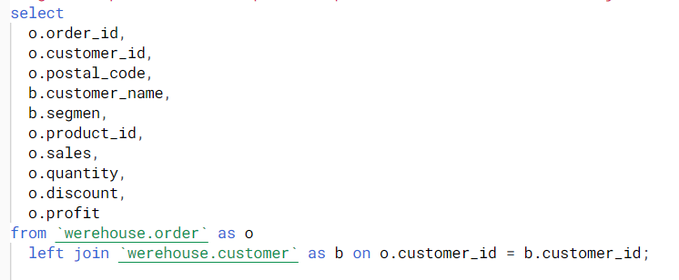

# 
<h1 align="center">
  
SQL-BIG QUERY : Left Join dan CTE

</h1>

## Left join
Dalam SQL, LEFT JOIN adalah salah satu jenis operasi penggabungan (join) antara dua tabel. Penggunaan LEFT JOIN memungkinkan Anda untuk menggabungkan baris dari tabel pertama dengan baris yang sesuai dari tabel kedua, berdasarkan pada kriteria yang ditentukan, dan juga akan menyertakan semua baris dari tabel pertama, bahkan jika tidak ada baris yang sesuai di tabel kedua.

## Common Table Expression (CTE)
Common Table Expression (CTE) merupakan suatu metode query yang dapat digunakan untuk menghasilkan set-data query yang bersifat sementara. Hasil CTE tidak tersimpan dan hanya ada selama eksekusi query berlangsung.

CTE sering dibandingkan dengan subquery, penggunaannya juga mirip seperti subquery. Namun CTE memiliki keunggulan dalam menangani nested subquery. Pada nested subquery, kita sering kebingungan mencari scope dari subquery tersebut.

# Dataset

dataset terdiri dari 5 data yaitu:
## Customer:
- customer_id: Ini adalah kolom yang berisi identifikasi unik untuk setiap pelanggan. Biasanya, ini adalah nomor atau kode yang digunakan untuk mengidentifikasi pelanggan secara unik dalam sistem atau basis data.
- customer_name: Kolom ini berisi nama dari setiap pelanggan. Ini adalah informasi tentang siapa pelanggan tersebut, yang digunakan untuk mengidentifikasi atau merujuk ke pelanggan secara informal atau dalam interaksi dengan pelanggan.
- Segmen: Ini adalah kolom yang berisi informasi tentang segmen atau kelompok di mana pelanggan tersebut dikelompokkan. Tiga segmen yang disebutkan adalah Consumer, Corporate, dan Home Office.

## Order
- order_id: Kolom ini berisi identifikasi unik untuk setiap pesanan. Setiap pesanan memiliki nomor atau kode yang berbeda untuk membedakan satu pesanan dari yang lain.
- customer_id: Kolom ini berisi identifikasi unik untuk setiap pelanggan yang melakukan pesanan. Biasanya, ini adalah nomor atau kode yang digunakan untuk mengidentifikasi pelanggan secara unik dalam sistem atau basis data.
- postal_code: Ini adalah kolom yang berisi kode pos atau kode pos alamat pelanggan atau alamat pengiriman pesanan. Kode pos digunakan untuk mengidentifikasi area geografis atau lokasi tempat pelanggan berada.
- product_id: Kolom ini berisi identifikasi unik untuk setiap produk yang dipesan. Ini adalah nomor atau kode yang digunakan untuk mengidentifikasi produk secara unik dalam katalog atau basis data produk.
- sales: Ini adalah kolom yang berisi jumlah penjualan atau pendapatan yang dihasilkan dari pesanan. Ini mungkin merupakan jumlah uang yang dibayarkan oleh pelanggan untuk produk atau layanan yang dipesan.
- quantity: Kolom ini berisi jumlah produk yang dipesan dalam satu pesanan. Ini mengindikasikan berapa banyak unit produk yang dibeli oleh pelanggan dalam satu pesanan.
- discount: Ini adalah kolom yang berisi informasi tentang diskon yang diberikan pada pesanan. Diskon mungkin dinyatakan dalam persentase atau nilai absolut.
- profit: Ini adalah kolom yang berisi keuntungan yang dihasilkan dari pesanan. Ini adalah selisih antara pendapatan yang diperoleh dari penjualan (sales) dan biaya yang dikeluarkan untuk produk tersebut.

## Product
- Product_ID: Ini adalah kolom yang berisi identifikasi unik untuk setiap produk. Setiap produk memiliki nomor atau kode yang berbeda untuk membedakan satu produk dari yang lain.
- Category: Kolom ini berisi kategori utama atau klasifikasi tingkat tinggi dari produk.
- Sub_category: Ini adalah kolom yang berisi kategori yang lebih spesifik atau subkategori dari produk.
- Product_Name: Kolom ini berisi nama dari setiap produk.

## Region
- country: Ini adalah kolom yang berisi nama negara di mana suatu entitas geografis terletak.
- city: Kolom ini berisi nama kota.
- state: Ini adalah kolom yang berisi nama negara bagian atau provinsi.
- postal_code: Kolom ini berisi kode pos atau kode pos.
- region: Ini adalah kolom yang berisi informasi tentang wilayah geografis tertentu.

## Shipment
- order_id: Ini adalah kolom yang berisi identifikasi unik untuk setiap pesanan. Setiap pesanan memiliki nomor atau kode yang berbeda untuk membedakan satu pesanan dari yang lain.
- order_date: Kolom ini berisi tanggal ketika pesanan ditempatkan atau dibuat. Ini adalah tanggal ketika pelanggan melakukan pembelian atau membuat pesanan untuk produk atau layanan tertentu.
- ship_date: Ini adalah kolom yang berisi tanggal ketika pesanan dikirim atau diproses untuk pengiriman. Ship_date mencerminkan kapan pesanan sebenarnya meninggalkan gudang atau tempat penyimpanan untuk dikirim ke pelanggan.
- ship_mode: Kolom ini berisi mode pengiriman atau cara pengiriman yang digunakan untuk mengirim pesanan ke pelanggan.

## Left join Query
gunakan prefix untuk mempermudah penulisan alias. di bawah ini join antara order dengan custumer.

kita akan join data Customer dan Order sebagai berikut:

output:

